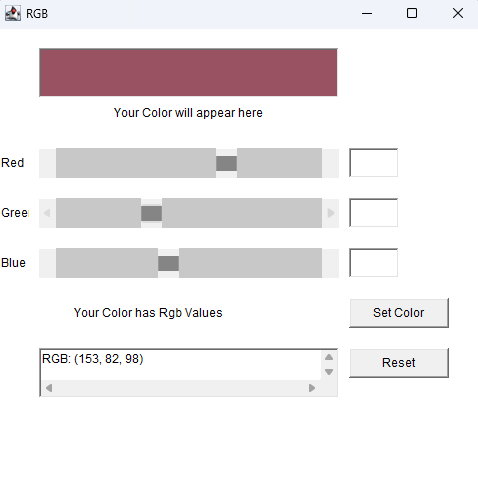

# RGB Color Picker Application

## Overview
This is a simple RGB Color Picker application built using Java's AWT (Abstract Window Toolkit). The application allows users to adjust the red, green, and blue values of a color using sliders and input fields. The resulting color is displayed on the interface, and users can reset the color back to black (RGB: 0, 0, 0).

## Features
- **Color Display**: Shows the resulting color based on the RGB values selected by the user.
- **RGB Sliders**: Horizontal sliders for adjusting the red, green, and blue color values.
- **Text Input Fields**: Allows users to input RGB values manually.
- **Reset Button**: Resets all RGB values to 0, clearing the color display.
- **Error Handling**: Displays error messages for invalid inputs.

## Requirements
- Java JDK 8 or higher
- IDE or text editor for Java development (e.g., IntelliJ IDEA, Eclipse, VS Code)

## Installation
1. Clone the repository to your local machine:

    ```bash
    git clone https://github.com/your-username/RGBColorPicker.git
    ```

2. Navigate to the project directory:

    ```bash
    cd RGBColorPicker
    ```

3. Compile the Java code:

    ```bash
    javac RGBProject.java
    ```

4. Run the application:

    ```bash
    java RGBProject
    ```

## How It Works
1. **RGB Sliders**: The user can adjust the color by moving the sliders corresponding to the Red, Green, and Blue values. The current values will be displayed on the screen, and the background color will change accordingly.
2. **Manual Input**: The user can manually input RGB values in the text fields. The color will be updated when the "Set Color" button is clicked.
3. **Reset**: Clicking the "Reset" button will reset all RGB values to 0, clearing the color display and input fields.

## Code Explanation
### MyFrame Class:
- **Scrollbar**: Each RGB color (Red, Green, Blue) has a corresponding scrollbar that adjusts the value of that color.
- **TextField**: Displays the RGB values and allows input.
- **Button**: Allows users to set a custom color or reset the color to the default (black).
##Output:



### Main Class:
- **RGBProject Class**: Contains the `main()` method, which creates the frame and makes it visible.

## Author
- **Aniket**:
- Developer and creator of the RGB Color Picker application.

## Acknowledgements
- Java AWT library for providing the necessary GUI components.
- GitHub for hosting the project.

